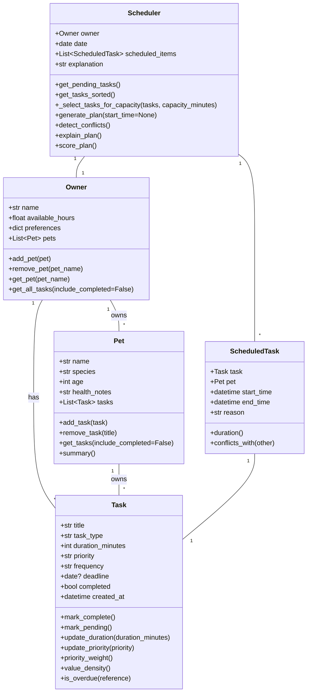

# PawPal+ (Module 2 Project)

You are building **PawPal+**, a Streamlit app that helps a pet owner plan care tasks for their pet.

## Scenario

A busy pet owner needs help staying consistent with pet care. They want an assistant that can:

- Track pet care tasks (walks, feeding, meds, enrichment, grooming, etc.)
- Consider constraints (time available, priority, owner preferences)
- Produce a daily plan and explain why it chose that plan

Your job is to design the system first (UML), then implement the logic in Python, then connect it to the Streamlit UI.

## What you will build

Your final app should:

- Let a user enter basic owner + pet info
- Let a user add/edit tasks (duration + priority at minimum)
- Generate a daily schedule/plan based on constraints and priorities
- Display the plan clearly (and ideally explain the reasoning)
- Include tests for the most important scheduling behaviors

## Getting started

### Setup

```bash
python -m venv .venv
source .venv/bin/activate  # Windows: .venv\Scripts\activate
pip install -r requirements.txt
```

### Suggested workflow

1. Read the scenario carefully and identify requirements and edge cases.
2. Draft a UML diagram (classes, attributes, methods, relationships).
3. Convert UML into Python class stubs (no logic yet).
4. Implement scheduling logic in small increments.
5. Add tests to verify key behaviors.
6. Connect your logic to the Streamlit UI in `app.py`.
7. Refine UML so it matches what you actually built.

## System Diagram (Mermaid)



## Smarter Scheduling

PawPal+ now includes smarter scheduling capabilities:

- value-weighted task selection using a knapsack-style subset algorithm to maximize priority value within available minutes
- deadline-aware sort order (deadline, priority, duration, creation time)
- recurring task handling: `daily`/`weekly` tasks automatically create a next occurrence when completed
- conflict detection via `ScheduledTask.conflicts_with`, returning warnings instead of exceptions
- explanation supports warnings so the app can alert the user if overlaps are detected

## 📸 Demo

<a href="/Demo.png" target="_blank">
  
</a>


## Testing PawPal+

To run tests:

```bash
python -m pytest
```

Tests cover:

- `Task` completion and recurring generation (`daily` and `weekly` behavior)
- `Pet` task management
- planning using `Scheduler` including knapsack-based task selection
- conflict detection for overlapping schedule items
- plan scoring and explanation generation

### Confidence Level

- Reliability rating: ★★★★☆ (4/5)

This rating reflects all tests passing after the latest feature implementation, with strong support for core scheduling behavior and edge cases, while acknowledging more coverage could be added for rare and extreme cases (e.g., very large task lists or invalid user input).